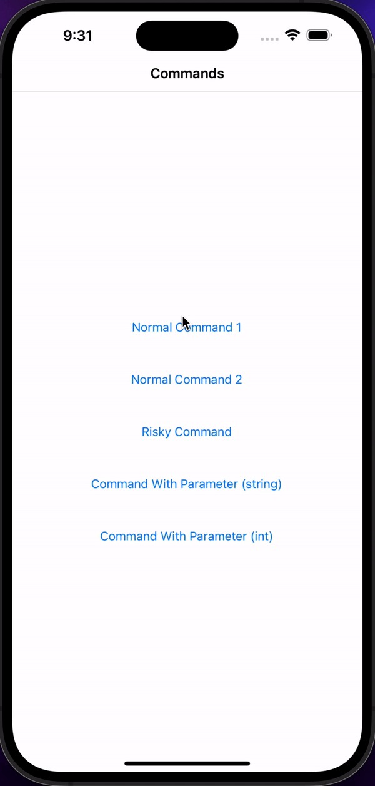
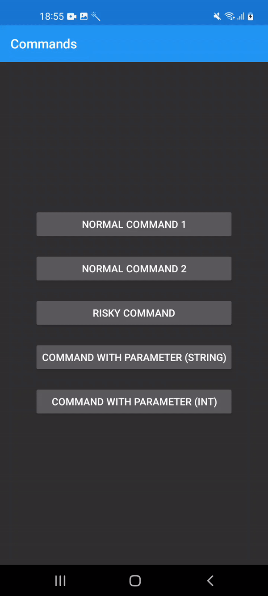

# AsyncCommand CanExecute
This is a sample app demonstrating a clean method of handling `CanExecute` for Xamarin.CommunityToolkit `AsyncCommand`s. This sample makes the usage of them more similar to how `DelegateCommand` works in prism where you don't need to write alot of custom code to handle raising execution changed events. This also makes your command handler tasks require less boilerplate since `CanExecute` will be automatically set and any Exceptions thrown will be handled (although you could change that if you want).

From the xct docs there is the following [snippet](https://learn.microsoft.com/en-gb/xamarin/community-toolkit/objectmodel/asynccommand?WT.mc_id=mobile-13724-bramin&ref=morioh.com&utm_source=morioh.com#asynccommandt) where the can execute code boils down to:

```csharp
bool _isBusy;

public bool IsBusy
{
    get => _isBusy;
    set
    {
        if(_isBusy != value)
        {
            _isBusy = value;
            ButtonCommand.RaiseCanExecuteChanged();
        }
    }
}  

public IAsyncCommand<int> ButtonCommand { get; }
```

The problem with this implementation is that for every command you register, the `IsBusy` setter needs to reference that command. This prevents you from being able to put the `IsBusy` / `CanExecute` property in a base class unless you provide some way of registering your commands. 

This sample app provides a base class where the `CanExecute` logic is automatically set for the commands without having to write alot of boilerplate. One downside is that is changes how you create your commands in your viewmodels. I've also not fleshed out ideas like disabling a specific command (ie, only allow execution if `CanExecute && Foo`).

Another downside of all `ICommands` that implement a `CanExecute` pattern is that your command handlers need to toggle the `CanExecute` bool manually:

```csharp
public async Task MyHandler()
{
    CanExecute = false;

    try
    {
        await DoSomething();
    }
    finally
    {
        CanExecute = true;
    }
}
```

This sample autowires up this behaviour so that you just need to write your actual viewmodel code and not worry about writing boilerplate (which is also easier to test now!).

## Sample

The sample is quite simple, it just has some buttons and some 1 second tasks. When one command executes, all commands are disabled during execution.

| iOS                                                  | Android                                                      |
| ---------------------------------------------------- | ------------------------------------------------------------ |
|  |  |